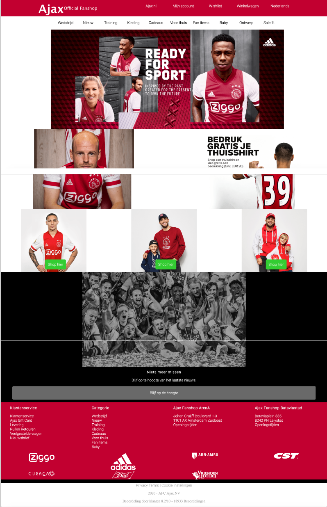
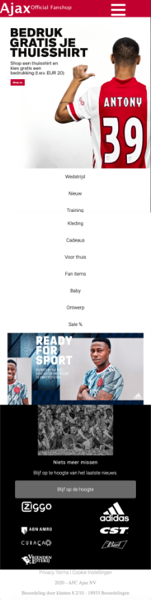
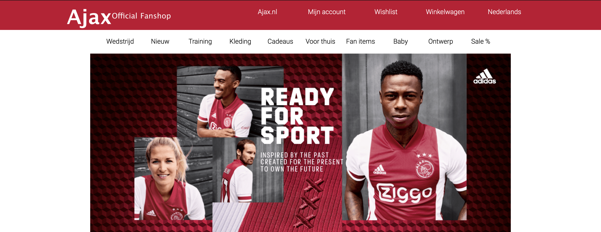
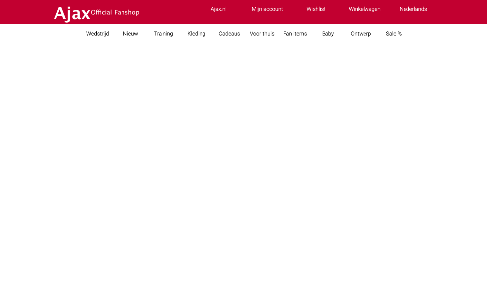
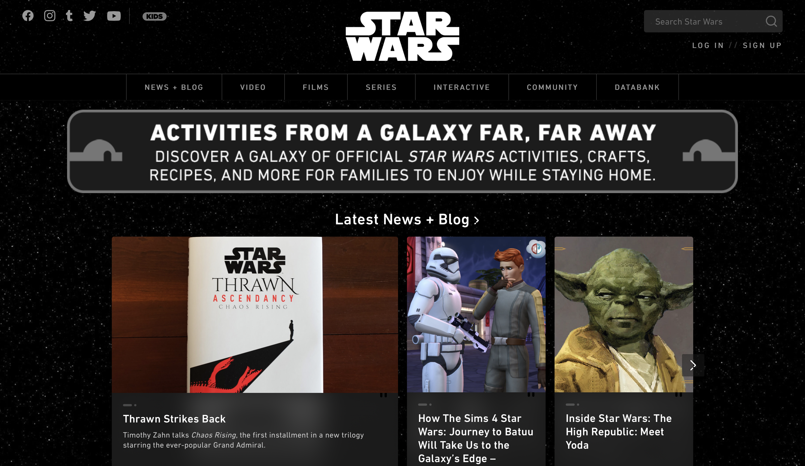
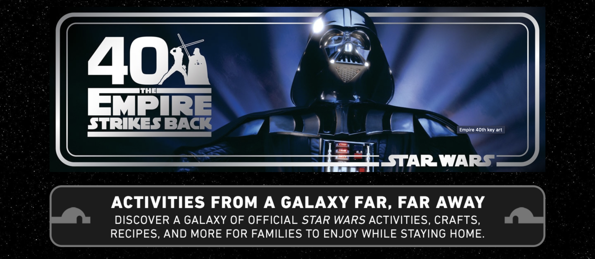
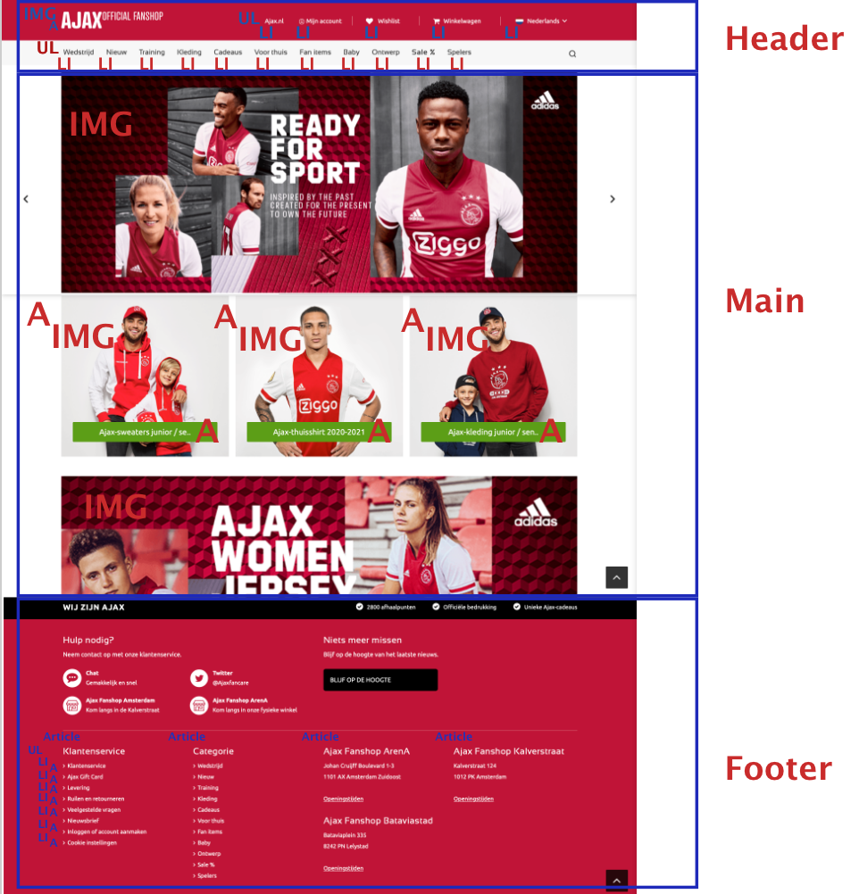

# Procesverslag
**Auteur:** Max Jasperse

Markdown cheat cheet: [Hulp bij het schrijven van Markdown](https://github.com/adam-p/markdown-here/wiki/Markdown-Cheatsheet). Nb. de standaardstructuur en de spartaanse opmaak zijn helemaal prima. Het gaat om de inhoud van je procesverslag. Besteedt de tijd voor pracht en praal aan je website.

## Bronnenlijst
1. DLO Opdracht Flex 2
2. Dlo Opdracht Grid
3. https://css-tricks.com

## Eindgesprek Her (week 9/10)

Ik vond het moeilijk om in te schatten welke content ik moest maken en hoe ik dat moest namaken. 

**Screenshot(s):**

## Voortgang 3 (week 6) 7/8 Eindgesprek

Ik heb het niet optijd afgekregen. Ik wilde mij eerst afmelden maar de docent vroeg mij alsnog te komen om te kijken wat ik wel had. Dit bleek al erg nuttig te zijn. Ik was toch. iets verder dan ik dacht. Ik was namelijk weer veel te moeilijk aan het denken. Ik wilde te ingewikkelde code neerzetten terwijl dit "maar" een 2e jaars vak is. Dit gaf me al wat meer rust in ging ik met een beter gevoel verder.

## Voortgang 2 (week 5)

Ik had niet veel kunnen werken aan de site door het drukke blok. Ik had veel deadlines om te maken. Ik had naast mijn header 1 banner toegevoegd. Ik had aan de docent assistenten gevraagd hoe ik het best de banner kon doen. Aangezien dat meer een slideshow was. Ik kreeg daar beetje een dubbel antwoord op. Het ging van opzoeken op youtube naar moet je dit wel maken. Uiteindelijk veel opgezochten maar was te moeilijk en wilde ook niet alles kopieren van andere sites.

## Voortgang 1 (week 3)

### Stand van zaken

Menu responsive. Mobile first is nog wat op aan te merken. Ik had dit niet goed begrepen. Ik was meteen bezig met web om die responsive te maken. Meteen na voortgangsgesprek bezig geweest met mobile first werken.

**Screenshot(s):**

### Agenda voor meeting

n.v.t dit hebben wij als inhaal klas niet gedaan.

### Verslag van meeting

Ik had nog niet bepaald een idee welke site ik ging maken. Uiteindelijk heb ik besloten paar dagen na sleutelen aan Star Wars site te gaan werken aan de jax Fanshop site, dit omdat daar meer variatie in conctent te vinden was. Dit zal wat beter zijn om na te maken aangezien ik dan bezig ben metverschillende elementen.

## Intake (week 1)

**Je startniveau:** blauw

**Je focus:** responsive 

**Je opdracht:** https://www.ajaxshop.nl/nl

**Screenshot(s):**
Ik weet nog niet of ik Star Wars of Ajax Fanshop ga doen.

**Breakdown-schets(en):** 
Ik weet nog niet of ik Star Wars of Ajax Fanshop ga doen, bij deze 2 breakdownschetsenvan beide sites.

Ik weet nog niet of ik Star Wars of Ajax Fanshop ga doen, bij deze 2 breakdownschetsenvan beide sites.

